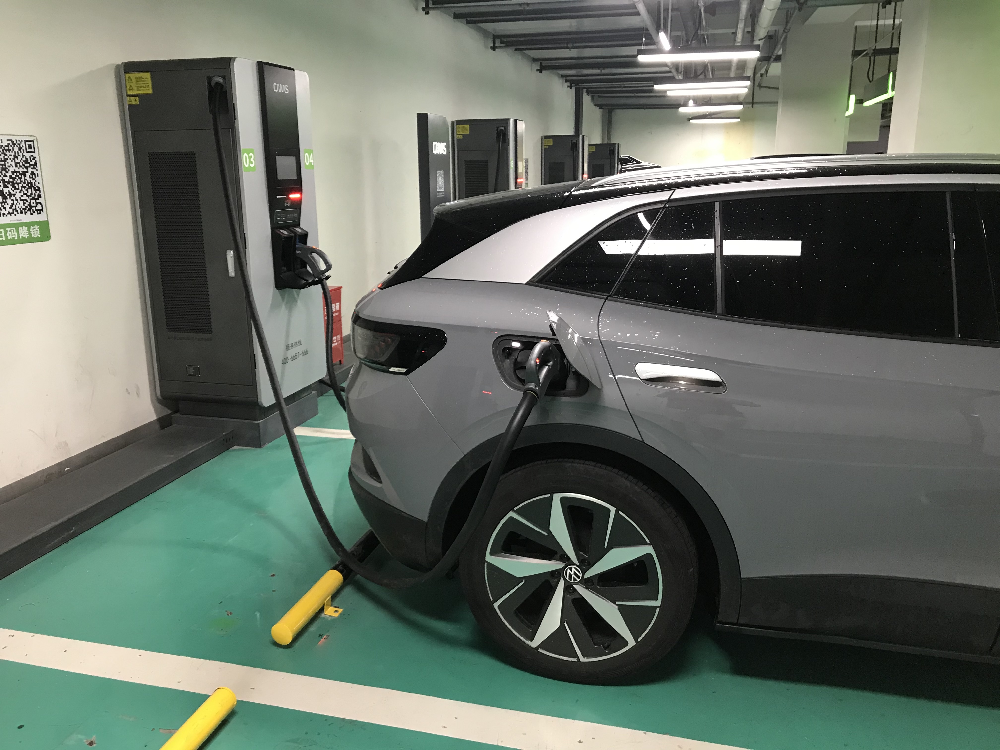
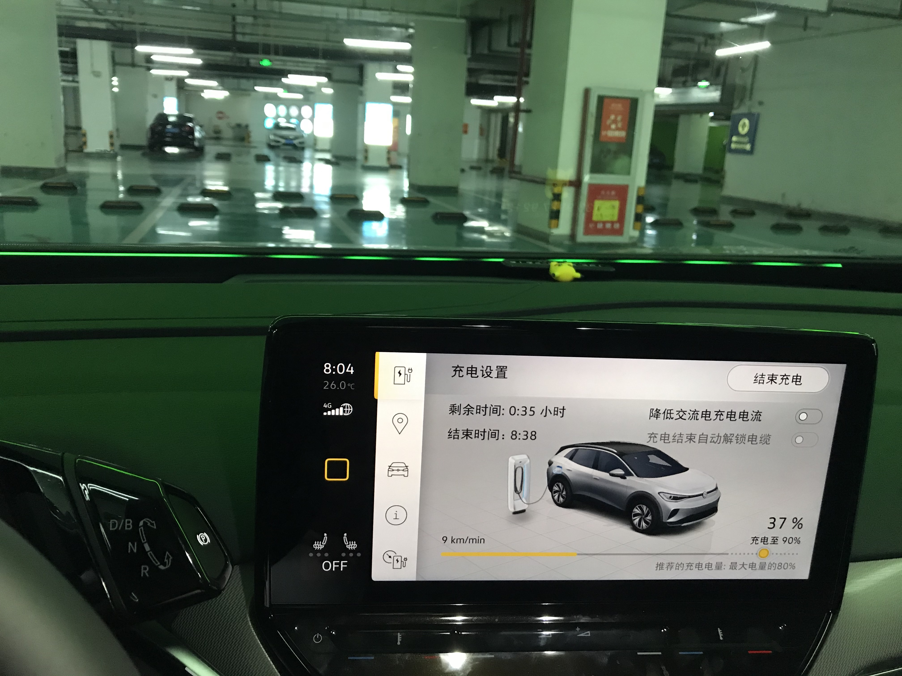
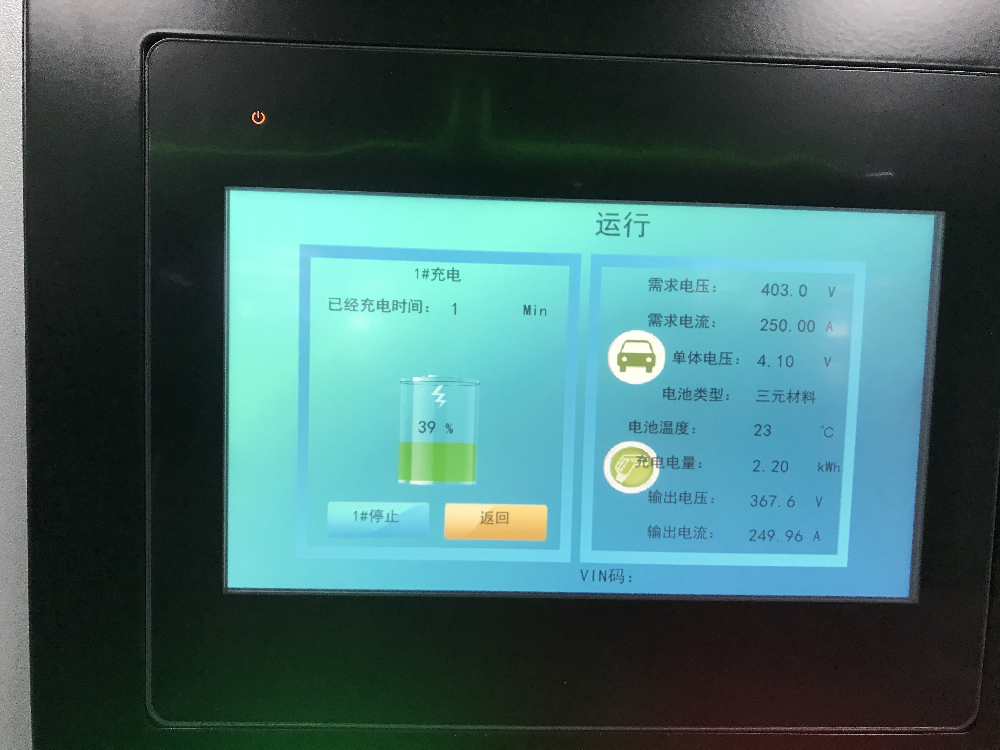
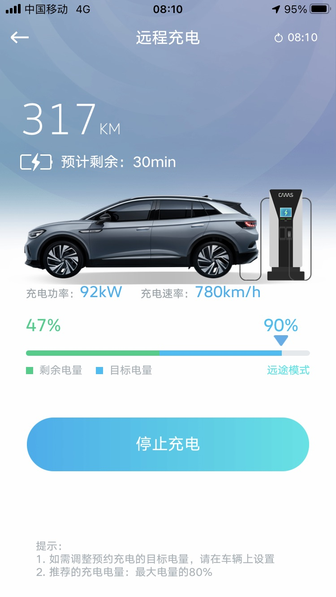
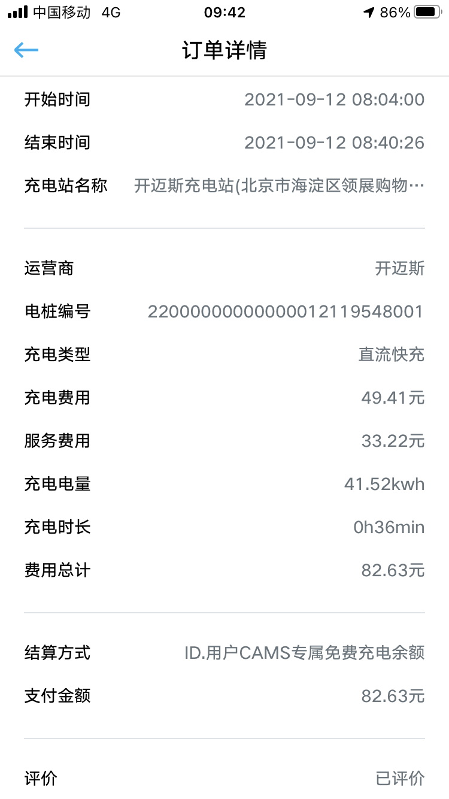

# 迟到的 CAMS 初体验

距提车差不多也有两个月了, 这才是柚柚爸第一次体验开迈斯充电. 原因主要有两个: 1) ID.4crozz 续航扎实, 日常家里领导只在家里周边开开, 550 km 的续航两周都不用充一次; 2) 偌大的海淀区竟然一家开迈斯都没有...

盼望着, 盼望着, 秋天到了, 海淀区的第一家开迈斯也开业了. 在中关村附近的朋友一定知道欧美汇和新中关两大购物中心, 而海淀区的第一家开迈斯就开在原欧美汇, 现领展购物中心的地下停车场 B3. 

先用 CAMS APP 打开站点情况, 发现还有实景电子路书, 这对实际上路还不满百公里, 真.菜的柚柚爸实在是太贴心了. 

于是在周日清晨, 趁家里人还没起床, 柚柚爸就果断出发, 人生第一次自驾到中关村区域活动.
很快柚柚爸就带着心爱的小灰来到了海淀区第一家开迈斯超充站, 停车场和充电区域都相当明亮大气.

大众 APP 扫码降锁, 然后插枪充电. 虽然柚柚爸也没充过几次电, 但这个基本的套路还是会的. 很快充电机和车机都开始显示充电状态. 开迈斯的速度真的有种"原汤化原食"的感觉, 那可是相当优秀啊.

各种算法的功率都在 90 kW 左右.

趁着补电的工夫, 柚柚爸去旁边 Starbucks Reserve 买了份早饭. 吃完饭再一看 APP, 已经接近了预设的 90% 目标, 于是下楼回家去也.

充电总计 36 min, 使用专属余额结算, 全程体验相当流畅.

PS: 领展会员可用 200 积分兑换一小时免费停车(注册送 200 积分), 正常的停车费用是 8 元每小时.

北京市的 ID.4 用户有很多是在上地四方购车的, 相信随着海淀区第一家开迈斯的开业, 大家的快充体验会有很大的提升 :) 希望海淀区能有更多的开迈斯投入运营.
